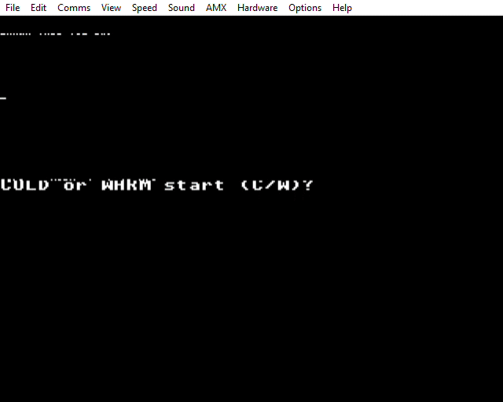

# Z80 Port of Acornsoft Forth



This is a port of Acornsoft Forth for the BBC Micro to the Z80 second processor. It is not
complete yet, but is basically functional interactively and includes a large number of unit tests.

I have no real use for it, but I was interested in Forth, keen to re-learn 6502 and Z80 assembler,
and interested in the BBC, so it seemed like a nice little project.

The source for the port was a disassembled version of Acornsoft Forth found on the
internet. Almost all 6502 code has been rewritten (apart from the initial stub that runs on the
host processor), but the words implemented in Forth remain. Some of the 6502 code seems to have
been taken pretty much verbatim from FIG-Forth (see
http://www.forth.org/fig-forth/fig-forth_6502.pdf), excluding BBC-specific parts of course.

It is not intended to be optimal. I am well aware that there are already plenty of Z80 Forths,
but I have deliberately not consulted those in order to force myself to figure things out.

This is provided purely for educational purposes.

# Word Structure

```
Name Field
Link Field
Code Field
...
```

# Registers

The Z80 stack is used as the Forth stack.

`IY` is the Forth instruction pointer. Address of memory containing current CFA.

On entry to a word, `BC` contains the code field pointer, `HL` contains the contents of the code
field of the word (ie. the address just jumped to).
